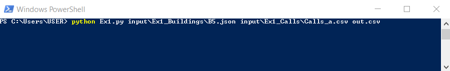
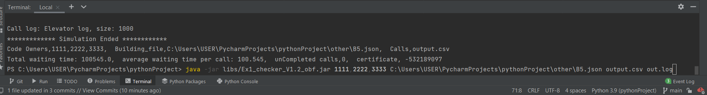

# Elevators-offline problem
In this assignment we get a building with some floors and elevators, and we need to design in the best way the requests of the people that want to use the elevators.
in our input files we get csv file of all the request and the parameters of the building floors we need to design it in the best way.

this problem is an offline algorithem problem, because we got all of our data before, and we calculate the output for the future action od the elevator

# Our reaserch
when we search about this problem we find some idea of algorithms that we can use to find the best way to sort the calls to the elevators.
the most effective algorithm that we thought to use is the "Travelling Salesman problem"
the complexity of this algorithm is: 2^n and for a big amount of calls and elevators it will take a lot of time to find the design of the request.
  
so we choose to use a "greedy algorithm" that find for the request call what is the closest elevator that will take this call the fastest.
 

# This is the main source that we learn about this problem:
1. https://thinksoftware.medium.com/elevator-system-design-a-tricky-technical-interview-question-116f396f2b1c - elevator system design from medium
2. https://www.youtube.com/watch?v=xOayymoIl8U&ab_channel=SpanningTree - YouTube videos that sum verity of algorithms for elevators
3. https://www.youtube.com/watch?v=JXqVvmBOyyQ&ab_channel=Intertent - another Youtube video that explain the different method of how to use elevators

# Our code

In our algorithm we scan over every second from the first call to the last and see if there is a new call for this time.
if we have new call we search elevators that will pass this floor in its action or elevators that have no calls to answer at all.
we save this potential elevators and find the best elevator of them that will take this call the fastest.
if there is some calls in the same second we choose the right elevator to the calls and then moving second ahead.

*The main idea of the code
1. we scan for every second if there is a new call in the building
2. if we have a new call - we update the location of each elevator and it's parameters about its direction and next floor
3. the program choose the elevators that potentials to complete this call fast 
4. from this group of elevators we find in step 3, we calculate the fastest call that will answer about this call
5. we update the new value of the chosen elevator with the new call it can be answer
6. we check if there are more calls to answer. if there isn't - we continue to move the time forward

# *Uml*

# the algorithm results: 

# *how to use the code*
if you want to use the code do the next steps:
1. download the files from the git
2. run the code and see the result .\
       ***you have two chose to run the code:*** .\
      a) run the tester and the code -> it will return out file and show you the result in the terminal.\
      To do that you need to run to commend "python Ex1.py (path to the building)
       input\Ex1_Buildings\B5.json (path to the calls) input\Ex1_Calls\Calls_c.csv (the out file name) out.csv".
      the function "runTester" do it all together.\
      b) run just the code, and it makes "out.csv" file.\
      then you can enter to the terminal command  and run the tester simulation from by writing:
      python Ex1.py input\Ex1_Buildings\B5.json input\Ex1_Calls\Calls_a.csv out.csv

3. you would see in the terminal line the result of your chosen situation and the average time waiting for a person.
in the csv file called out.csv you will see the ID of the chosen elevator for any calls in it.\
for example:

you can make your own csv and json files that contains calls and parameters of the elevators and run the code to choose for your own situation.
